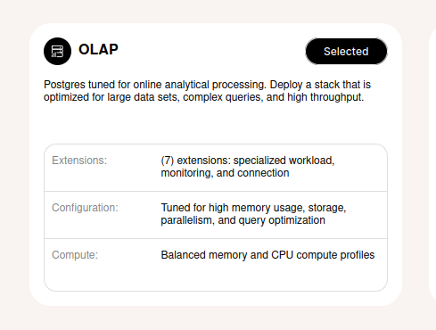
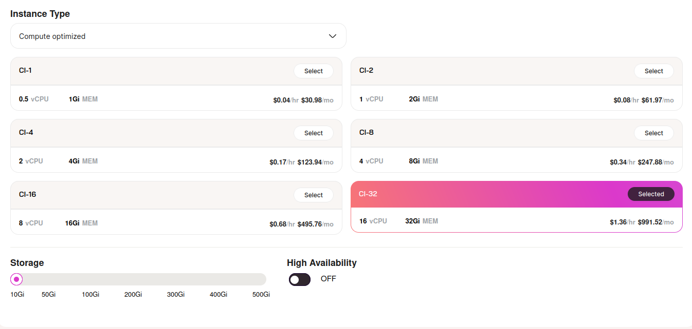

# Instantiation

1- Create Account and Login to https://cloud.tembo.io

2- Select OLAP Stack after clicking Create Instance button.




## Choose System Configuration:

**Instance Type**: Compute Optimized (CI-32)

**CPU**: 16vCPU

**RAM** : 32GB

**Storage**: 300GB




Instance creation takes *20-25* seconds.

## Connection String
Tembo provides connection-string through instance **Home** tab.

```
export PGPASSWORD=TEMBO_GENERATED_PGPASSWORD
export PGHOST=TEMBO_GENERATED_PGHOST
```

## Data loading
Data loaded remotely using psql client.

**psql** installation

```
sudo apt-get update
sudo apt-get install -y postgresql-client

```
**Data** download

```
wget --no-verbose --continue 'https://datasets.clickhouse.com/hits_compatible/hits.tsv.gz'

gzip -d hits.tsv.gz
```

**Data** loading

```
psql postgresql://postgres:$PGPASSWORD@$PGHOST:5432 -t -c 'CREATE DATABASE test'

psql postgresql://postgres:$PGPASSWORD@$PGHOST:5432/test -t < create.sql

psql postgres://postgres:$PGPASSWORD@$PGHOST:5432/test -t -c '\timing' -c "\\copy hits FROM 'hits.tsv'"

psql postgresql://postgres:$PGPASSWORD@$PGHOST:5432/test -t < index.sql

psql postgres://postgres:$PGPASSWORD@$PGHOST:5432/test -t -c "select pg_total_relation_size('hits');"
            33864704000


```

## Benchmark Start

```
./run.sh 2>&1 | tee log.txt

cat log.txt | grep -oP 'Time: \d+\.\d+ ms' | sed -r -e 's/Time: ([0-9]+\.[0-9]+) ms/\1/' |
    awk '{ if (i % 3 == 0) { printf "[" }; printf $1 / 1000; if (i % 3 != 2) { printf "," } else { print "]," }; ++i; }'

```